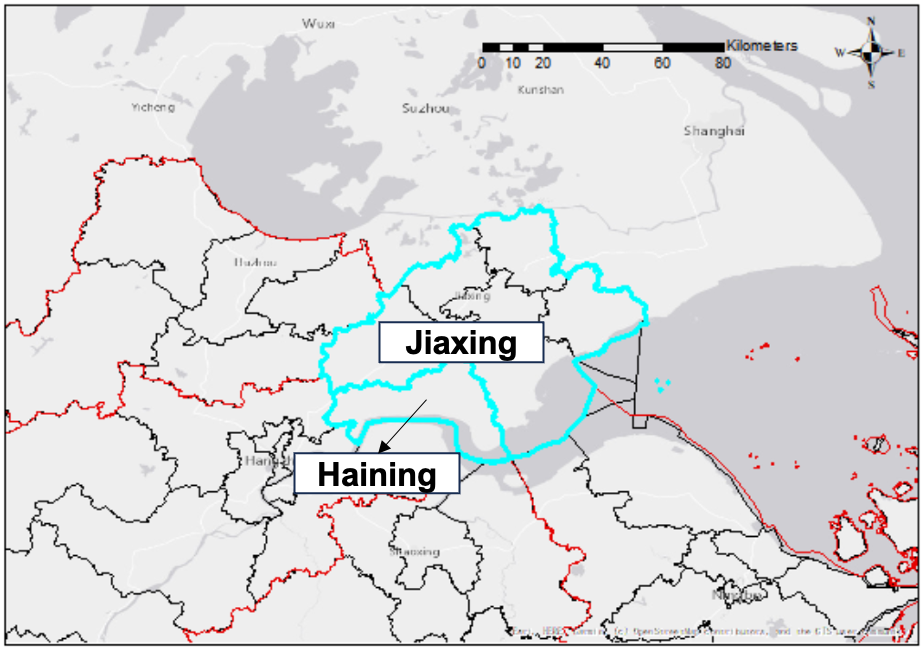
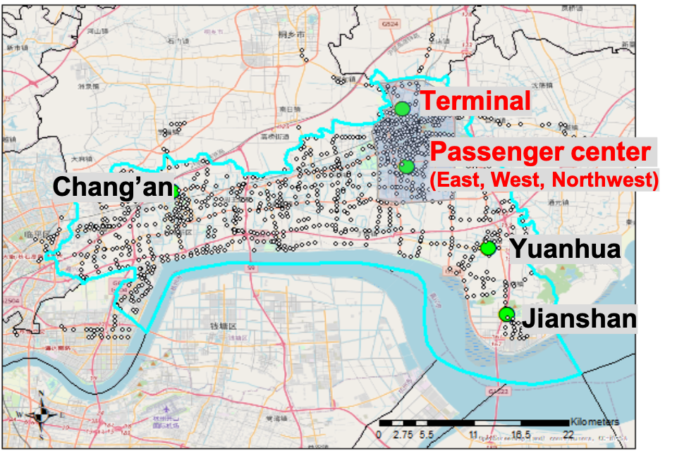

Public transit, especially bus service, is critical to maintaining equal traveling accessibility in urban & suburban areas, and local governments usually cover the expenses of the bus operation. The logic here is, what the government pays has to see the effect, like the increasing ridership, the improved services, etc. The reality is, that the system reflects the declining ridership, the decreasing budget, and the degraded services (as you can read from a lot of social news). Imagine you are the decision maker, for sure, you do not want to continue supporting such a program.
However, as a crucial part of social welfare, the service of public transit is definitely gonna persist. At the same time, public transit is a perfect pilot to electrify, as it is centrally controlled and can be planned & coordinated systematically to reach the optimal. Subsidies for the bus energy transformation also go beyond the private sector; on the other hand, the resource planning & the subsidy policies for the public sector can be a mirroring of what will happen in the private sector (or public for-profit sectors) given similar practices. As for today, I would like to summarize the current condition into two challenges, based on our data-mining result from Haining County, an aging suburban area with more than 13% of the population aged over 65 (well, not that much suburb if you compare with places like Maine, no offense if any). From the following figures, you can see the location, the bus depot, and the daily passenger boarding count of this county.

<figure>
  
  <figcaption>Figure 1: The location of Haining County</figcaption>
</figure>

<figure>
  
  <figcaption>Figure 1: The location of bus depots in Haining County (red: within the city center)</figcaption>
</figure>

(as you can imagine, most of the transactions are from discount or free cards)

1. **Incentives reduce** **the** **cost** **from** **agencies, leading to** **excessive** **fleet** **and chargers**

Such a nearly “cover all expenses” incentive policy leads to an irrational investment in both bus fleets and fast chargers. First, agencies tend to select bus types without surveying — buying large buses and pair chargers for almost every bus — because they do not have to pay and they need to ensure operational stability. The outcome is vast expenses on maintenance and substantial waste of resources — low occupancy on buses and low usage efficiency of chargers.

1. **Diesel bus experiences do not support such a drastic fleet change**

Traditional bus services were running on the basis of diesel buses, while electric buses are different in terms of the charging cycle, the degradation (the cost), and hence the scheduling. The lack of e-bus operation experiences or insufficient considerations on the charging schedule results in random charging behavior: drivers charge when they finish the work of the day or when they get to rest during lunch or in the afternoon (see the picture for the daily charging profile in our sampled city).

Actually, according to our calculation, the total daily boarding on a typical weekday is 22,614 and concentrated within the center (marked in red), the total revenue is 12,716 CNY. Guess how much the cost is? 190,625 CNY, ten times of the revenue, which means the government has to cover 93.3% of the total expenses. As we said before, the ultimate goal of public transit is not profit or break-even, but if the ridership is low and a lot of bus routes cannot even collect a single passenger, so why the government wants to pay for it?

Let’s first try to tackle these two questions, and formulate an EVSP (electric-vehicle-scheduling-problem) to simultaneously optimize the charging timeslot and the bus fleet assignment (i.e., choose the correct size of the bus to run a service trip). We abstracted trips (including charging trips and service trips) as nodes, and the connection between trips (i.e., whether I have to run the next trip after finishing this trip) as arcs, and the whole network looks like. For the mathematical formulation, please refer to our publication: https://doi.org/10.1016/j.trd.2023.103724

Next, we use a heuristic algorithm, Adaptive Large Neighbor Search (ALNS) to search for the optimal solution. The convergence is pretty good, given the large network we set in the formulation (112 routes with more than 400 service buses). Here are our results.

First, we optimized the fleet distribution. After optimization, the total number of required buses drops to 363 (less than the base case by > 100). We added more smaller-sized buses into the network to reduce the life-cycle facility cost (maintenance, repair, etc.): 101 buses (83 Type-A mini-buses) should be settled. Those larger-sized buses can be put into specific scenarios such as the shuttle within the industrial plants. Those additional smaller buses, can be subsidized by the newly released “old-to-new” equipment replacement policy.

We can look into the bus size distribution for each station in detail. Depots with less passenger demand, regardless of their long routes (as for today, the driving range of e-buses is no longer a headache for the daily operation), smaller vehicles are still preferred, and it is easier to purchase and maintain smaller buses.

Then, let’s compare the maxium chargers used at one timeslot before and after the optimization. It is clear that less charging plugs are used after optimization, obviously lower than the existing total plugs. That again reinforces our previous statement that the chargers are over-installed, and the efficiency can be even improved with the optimization. To make full use of the current facilities, we can open the remaining to the public for additional profits (as has been piloted in many cities like [Shanghai](https://www.pudong.gov.cn/019001001/20240827/785638.html), [Beijing](https://www.beijing.gov.cn/fuwu/bmfw/sy/jrts/202410/t20241013_3918227.html), and [Qingdao](https://finance.sina.com.cn/roll/2024-08-18/doc-inckaqma2066918.shtml)) — For sure there are a lot of safety and standard issues of this practice, but we are working towards that!

One of the problems of the optimized schedule on human-driving bus routes is that, the optimized schedule should be follow strictly, while for our case, interestingly, we find the drivers only have to follow the starting time of the charging besides the scheduled trips. Here is our evidence. No matter how we changed the charging duration from 10 minutes to 60 minutes, the cost does not change much — which means the charging duration can be pretty flexible as long as the drivers follow our guidance on the trip schedule.

Finally, the optimized cost vs. the base case (the current case) is shown in the following figure. The labor cost takes the greatest portion since it is a linear increase with the expansion of the network size, and will not be optimized because we did not include it in our decision variables.

The purchasing cost and the charging cost present a significant drop thanks to our optimization. In summary, the total cost is reduced by 17.9%, and the cost per depot reduces by up to **20.6%.** Good or bad, the story is two-sided: the local government still needs to pay for **~90%** of the expenses ****to break even, while the actual money to cover the cost decreases by **19.1%** (a big shoutout 🎉).

As a final remark, the optimization is one of the solutions to address the challenges of the current public transit. Instead, how to improve the service quality, plan the route to match the demand, and provide flexible on-demand services, are essential to increase (or at least maintain) the ridership — a key performance index to illustrate the service coverage and the accessibility of the public transit. Another point that is ignored by a lot of traffic engineers is the financial model. Should the government take all the burden of bus subsidies? How to stimulate the motivation of these bus agencies to provide a better and more cost-effective services? How to reshape the economic relationship among fleets, drivers, charging facilities, and bus agencies? These remain to be discussed in the future.
